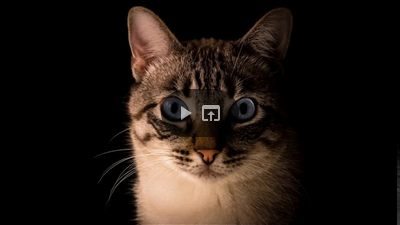

# Wikibase Local Media

[](https://github.com/ProfessionalWiki/WikibaseLocalMedia/actions?query=workflow%3ACI)
[](https://packagist.org/packages/professional-wiki/wikibase-local-media)
[](https://packagist.org/packages/professional-wiki/wikibase-local-media)
[](LICENSE)

MediaWiki extension that adds support for local media files to [Wikibase] via a new data type.

[Professional Wiki] created and maintains Wikibase Local Media. We provide [Wikibase hosting], [Wikibase development], and [Wikibase consulting].

[Rhizome] commissioned and funded the extension's initial development. Wikibase Local Media is an open-source project, and contributions are welcome!

## Demo and screenshot

<a href="https://www.youtube.com/watch?v=mK-zdazdH78"></a>
<a href="https://user-images.githubusercontent.com/146040/94343935-0e10d300-001c-11eb-8ec2-6f86ccf20e2f.png">

</a>

Also see [this animated gif](https://twitter.com/i/status/1286293710112731137).

## Platform requirements

* [PHP] 7.4 or later
* [MediaWiki] 1.39 or later
* [Wikibase Repository] REL1_39 or later

For more information on the different versions of this extension, see the [release notes](#release-notes).

## Installation

First, install MediaWiki and Wikibase Repository.

**Using Composer (option 1/2)**

The recommended way to install Wikibase Local Media is using [Composer](https://getcomposer.org) with
[MediaWiki's built-in support for Composer](https://professional.wiki/en/articles/installing-mediawiki-extensions-with-composer).

On the commandline, go to your wiki's root directory. Then run these two commands:

```shell script
COMPOSER=composer.local.json composer require --no-update professional-wiki/wikibase-local-media:*
composer update professional-wiki/wikibase-local-media --no-dev -o
```

**Manual download (option 2/2)**

You can also install the extension via git clone or download. Place the `WikibaseLocalMedia` directory into `extensions`.

**Enabling the extension**

Then enable the extension by adding the following to the bottom of your wikis `LocalSettings.php` file:

```php
wfLoadExtension( 'WikibaseLocalMedia' );
```

You can verify the extension was enabled successfully by opening your wikis Special:Version page in your browser.

## PHP Configuration

Configuration can be changed via [LocalSettings.php].

### Setting foreign file repo

Optional wiki API URL, works in conjunction with `$wgForeignFileRepos` for retrieving images from any wiki

Variable: `$wgWikibaseLocalMediaRemoteApiUrl`

Default: `null`

Example: `https://commons.wikimedia.org/w/api.php`

## Running the tests

* PHP tests: `php tests/phpunit/phpunit.php extensions/WikibaseLocalMedia/tests/`
* JS tests: `index.php?title=Special%3AJavaScriptTest&filter=jquery.ui.mediasuggester`

## Release notes

### Version 1.1.0

Released on February 16, 2025

* [Added optional APU URL configuration variable](https://github.com/ProfessionalWiki/WikibaseLocalMedia/pull/37) `wgWikibaseLocalMediaRemoteApiUrl` (works together with `wgForeignFileRepos`)
* Translation updates

### Version 1.0.4

Released on October 9, 2024

* Fixed support for non-English wikis
* Fixed deprecation warning of MediaWiki 1.40 and later
* Translation updates

### Version 1.0.3

Released on March 30, 2023

* Added support for MediaWiki and Wikibase 1.38 and 1.39
* Translation updates

### Version 1.0.2

Released on October 4th 2022

* Added support for MediaWiki and Wikibase 1.37
* Translation updates

### Version 1.0.1

Released on March 17th 2021

* Allowed installation with PHP 7.2.x
* Translation updates

### Version 1.0.0

Released on October 5th 2020

* Added optional integration with Wikibase Client
* Translation updates

### Version 0.2.1

Released on September 28th 2020

* Fixed support for PHP 7.3.x

### Version 0.2

Released on September 26th 2020

* Added support for MediaWiki/Wikibase 1.35
* The extension is now listed in the Wikibase group on Special:Version

### Version 0.1

Released on September 26th 2020

* [Initial release] for MediaWiki/Wikibase 1.34

[Professional Wiki]: https://professional.wiki
[Wikibase]: https://professional.wiki/en/wikibase-wikidata-and-knowledge-graphs
[Wikibase hosting]: https://professional.wiki/en/hosting/wikibase
[Wikibase development]: https://professional.wiki/en/wikibase-software-development
[Wikibase consulting]: https://wikibase.consulting/
[Rhizome]: https://rhizome.org/
[MediaWiki]: https://www.mediawiki.org
[PHP]: https://www.php.net
[Wikibase Repository]: https://www.mediawiki.org/wiki/Extension:Wikibase_Repository
[LocalSettings.php]: https://www.mediawiki.org/wiki/Manual:LocalSettings.php
[Initial release]: https://professional.wiki/en/news/wikibase-local-media
